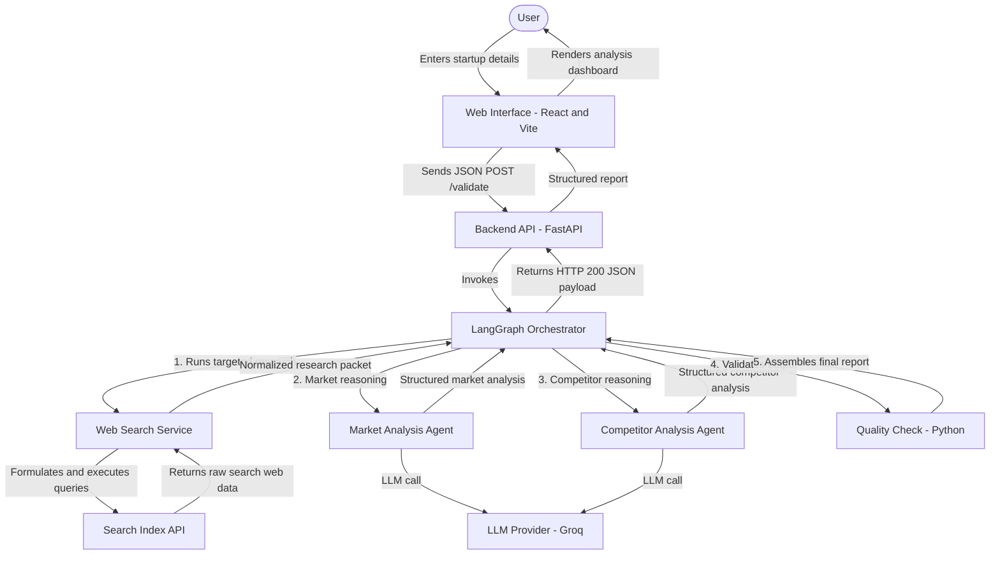

# AI-Based Startup Idea Validator with Market Analysis Assistance

An interactive web platform designed to validate startup concepts, map competitor landscapes, and generate structured market and competitive intelligence reports in real-time. Built as part of **Infosys Springboard 7.0 (Batch 3) by Team Pulse**.

---

## Project Overview

Starting a business requires exhaustive market research, competitor mapping, and analysis. This platform automates that process:
1. Users input their startup idea, target market, and industry sector.
2. The platform formulates targeted, category-specific searches and queries real-time web search indices.
3. Two specialized AI agents reason over that research -- one for market opportunity and customer segmentation, one for competitor discovery and comparison -- producing evidence-backed, structured findings instead of a raw results list.
4. A deterministic quality check validates source attribution and flags gaps before the final report is assembled.
5. Results are presented on a dashboard detailing market opportunity, customer segments, a competitor comparison matrix, and every source cited.

---

## Core Features

* **Interactive Parameters Form**: Capture startup ideas, targeted industries, and customer segments with input validation.
* **Targeted Research Service**: Runs 13 category-specific queries (market size, growth, customer pain points, competitor pricing, industry trends, and more) instead of one broad search, then deduplicates and normalizes the results.
* **AI Market Analysis Agent**: Extracts market size, growth/CAGR, demand signals, industry trends, and specific customer segments -- grounded strictly in the retrieved research, never invented.
* **AI Competitor Analysis Agent**: Identifies named competitors, classifies them as direct/indirect/new-entrant, and surfaces market gaps and differentiation opportunities.
* **Evidence-Only Policy**: Every factual claim is either backed by a real source URL or explicitly marked `"Not found in available sources"` -- no fabricated statistics, competitors, or pricing.
* **LangGraph Orchestration**: A deterministic pipeline (search → market analysis → competitor analysis → quality check → report) coordinates the agents, with graceful degradation if any step fails.
* **Sandbox Simulation Mode**: Seamless fallback to simulated local records if API keys are missing, allowing offline demonstrations of the full pipeline.
* **Structured Analysis Dashboard**: Executive summary, market opportunity, customer segmentation, competitor comparison table, and full source list, replacing the raw results list from the first release.

---

## System Architecture

The project is a decoupled client-server architecture with an AI orchestration layer between the search service and the API response:



The legacy `POST /search` endpoint (one broad query, no AI reasoning) is
still available for backward compatibility.

For more details on components and data schemas, view the [System Architecture Document](docs/system-architecture.md).

---

## Repository Structure

```
Team-Pulse-ISB7.3/
├── Backend/                          # Python FastAPI API Server
│   ├── services/                     # Core logic services
│   │   ├── search_service.py         # Targeted multi-category search + simulation fallback
│   │   ├── llm_client.py             # Shared LLM call wrapper (Groq)
│   │   ├── market_analysis_service.py    # Market opportunity reasoning
│   │   └── competitor_analysis_service.py # Competitor discovery reasoning
│   ├── agents/                       # LangGraph node wrappers
│   │   ├── web_search_agent.py
│   │   ├── market_agent.py
│   │   └── competitor_agent.py
│   ├── graph/
│   │   └── startup_validation_graph.py  # Pipeline orchestration, quality check, report assembly
│   ├── schemas/                      # Pydantic data contracts
│   │   ├── search_schema.py
│   │   ├── market_schema.py
│   │   ├── competitor_schema.py
│   │   └── final_report_schema.py
│   ├── prompts/                      # Evidence-only LLM prompts
│   │   ├── market_prompt.py
│   │   └── competitor_prompt.py
│   ├── .env.example                  # Environment variables template
│   ├── .gitignore                    # Backend-specific ignore file
│   ├── main.py                       # FastAPI routing: /, /health, /search, /validate
│   └── requirements.txt              # Python backend dependencies
├── frontend/                         # React Client Application (Vite)
│   ├── src/
│   │   ├── api/
│   │   │   └── validate.js           # Calls POST /validate
│   │   ├── components/dashboard/     # Structured analysis dashboard
│   │   │   ├── ExecutiveSummary.jsx
│   │   │   ├── MarketOpportunity.jsx
│   │   │   ├── CustomerSegments.jsx
│   │   │   ├── CompetitorLandscape.jsx
│   │   │   ├── Sources.jsx
│   │   │   ├── StartupAnalysisDashboard.jsx
│   │   │   └── dashboard.css
│   │   ├── App.css                   # Light-theme dashboard styles
│   │   ├── App.jsx                   # State controls & views
│   │   ├── index.css                 # Global typography & colors
│   │   └── main.jsx                  # React root mount
│   ├── index.html                    # Entry HTML template
│   └── package.json                  # Node dependencies and build scripts
├── docs/                              # Project documentation
│   └── system-architecture.md         # Architectural blueprint
└── README.md                          # Project documentation index
```

---

## Getting Started

### Prerequisites
* Python 3.8 or higher
* Node.js (v18 or higher) and npm

### 1. Setup the Backend
Navigate to the `Backend` directory:
```bash
cd Backend
```

Install Python dependencies:
```bash
python -m pip install -r requirements.txt
```

Configure your credentials inside a `.env` file (copied from `.env.example`):
```env
TAVILY_API_KEY=tvly-yourActualKeyHere
GROQ_API_KEY=gsk-yourActualKeyHere
GROQ_MODEL=openai/gpt-oss-120b
```
*Note: `TAVILY_API_KEY` is optional -- without it, the app runs in
simulated sandbox mode. `GROQ_API_KEY` is required for the AI market and
competitor analysis agents to produce real output; without it, `/validate`
still responds successfully but with those sections marked as
unavailable. Get a free Tavily key at [app.tavily.com](https://app.tavily.com)
and a free Groq key at [console.groq.com/keys](https://console.groq.com/keys).*

Start the FastAPI server:
```bash
python -m uvicorn main:app --reload
```
The API documentation will be available at `http://127.0.0.1:8000/docs`.

### 2. Setup the Frontend
Navigate to the `frontend` directory in a new terminal:
```bash
cd frontend
```

Install Node modules:
```bash
npm install
```

Configure the backend URL inside a `.env` file:
```env
VITE_API_URL=http://localhost:8000
```

Start the Vite development server:
```bash
npm run dev
```
Open **`http://localhost:5173`** in your browser to view the validator interface.

### 3. Try it
Fill in a startup idea, industry, and target market (or use one of the
example presets), then submit. The dashboard will show:
- **Executive Summary** -- headline numbers and any partial-failure warnings
- **Market Opportunity** -- market size, growth/CAGR, demand signals, industry trends
- **Customer Segmentation** -- specific segments with needs, pain points, and motivations
- **Competitor Landscape** -- a comparison table plus market gaps and differentiation ideas
- **Sources** -- every URL cited across the analysis

---

## Future Roadmap

With the AI reasoning layer now in place, the project will expand toward
persistence and richer sizing/export tooling:

* **Phase 3: Data Persistence & Idea History**
  * Integrate a SQLite/PostgreSQL database to store user ideas, validation histories, and report snapshots.
  * Enable user authentication so users can log in and manage their validated concepts.
* **Phase 4: Financial & Sizing Assist**
  * Add computational agents to estimate Total Addressable Market (TAM), Serviceable Addressable Market (SAM), and Serviceable Obtainable Market (SOM) based on demographic inputs.
  * Add automatic financial forecasting calculators.
* **Phase 5: Exportable Reports**
  * Implement PDF export capabilities to download beautiful, structured startup validation booklets.
  * Provide shareable report links for pitch decks.

---

## Team & Leadership

* **[Utkarsh Srivastav](https://github.com/UtkarshSrivastav09)** — **Team Lead & Full Stack Developer**

---

Developed by **Team Pulse** for Infosys Springboard 7.0 Batch 3.