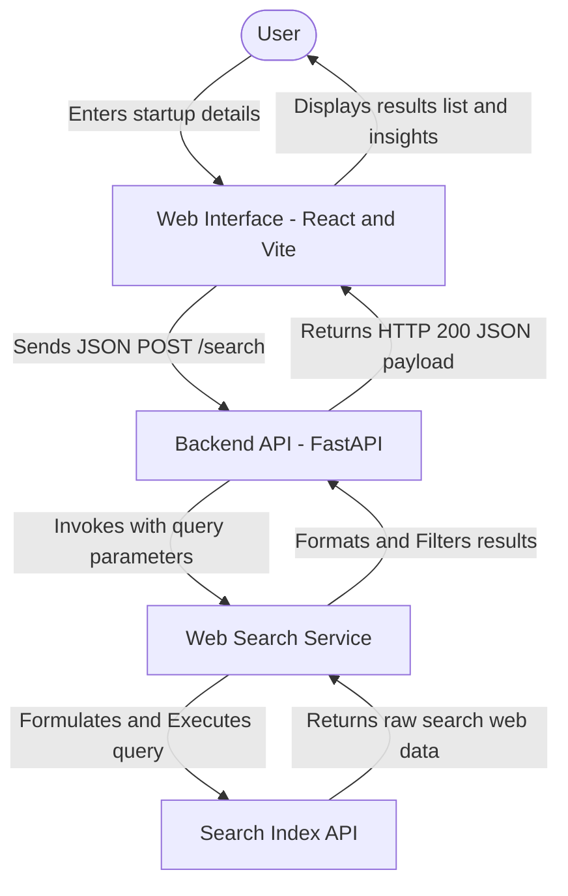

# AI-Based Startup Idea Validator with Market Analysis Assistance

An interactive web platform designed to validate startup concepts, map competitor landscapes, and generate market analysis reports in real-time. Built as part of **Infosys Springboard 7.0 (Batch 3) by Team Pulse**.

---

## 🚀 Live Deployments

Explore the production environments of the **Startup Idea Validator** below:

| Deployment Component | Platform | URL Link | Status |
| :--- | :--- | :--- | :--- |
| **Frontend Dashboard Client** | [](https://team-pulse-isb-7-3.vercel.app/) | [https://team-pulse-isb-7-3.vercel.app](https://team-pulse-isb-7-3.vercel.app/) |  |
| **FastAPI Backend Web Service** | [](https://team-pulse-isb7-3.onrender.com/) | [https://team-pulse-isb7-3.onrender.com](https://team-pulse-isb7-3.onrender.com/) |  |
| **Interactive API Documentation** | [](https://team-pulse-isb7-3.onrender.com/docs) | [https://team-pulse-isb7-3.onrender.com/docs](https://team-pulse-isb7-3.onrender.com/docs) |  |

---

## Project Overview

Starting a business requires exhaustive market research, competitor mapping, and analysis. This platform automates that process:
1. Users input their startup idea, target market, and industry sector.
2. The platform formulates targeted searches and queries real-time web search indices.
3. Raw data is parsed, relevance scores are calculated, and an executive synthesis summary is compiled.
4. Results are presented on a high-contrast slate-and-indigo dashboard detailing competitor matrices and market insights.

---

## Core Features

* **Interactive Parameters Form**: Capture startup ideas, targeted industries, and customer segments with inputs validation.
* **Targeted Search Service**: Formulates optimized queries to extract clean competitor snippets, relevance rankings, and URLs.
* **Executive Summary Synthesis**: Generates an analysis summarizing entry barriers, opportunities, and competitive trends.
* **Sandbox Simulation Mode**: Seamless fallback to simulated local records if API keys are missing, allowing offline demonstrations.
* **Sleek Light Dashboard**: A modern CSS dashboard utilizing glassmorphism styles, clear loaders, and transition effects.

---

## System Architecture

The project is structured as a decoupled client-server architecture:



For more details on components and data schemas, view the [System Architecture Document](docs/system-architecture.md).

---

## Repository Structure

```
Team-Pulse-ISB7.3/
├── Backend/                    # Python FastAPI API Server
│   ├── services/               # Core logic services
│   │   └── search_service.py   # Search queries & simulation fallback
│   ├── .env.example            # Environment variables template
│   ├── .gitignore              # Backend-specific ignore file
│   ├── main.py                 # FastAPI routing, validations & CORS
│   └── requirements.txt        # Python backend dependencies
├── frontend/                   # React Client Application (Vite)
│   ├── src/                    # Source files
│   │   ├── App.css             # Light-theme dashboard styles
│   │   ├── App.jsx             # State controls & views
│   │   ├── index.css           # Global typography & colors
│   │   └── main.jsx            # React root mount
│   ├── index.html              # Entry HTML template
│   └── package.json            # Node dependencies and build scripts
├── docs/                       # Project documentation
│   └── system-architecture.md   # Architectural blueprint
└── README.md                   # Project documentation index
```

---

## Getting Started

### Prerequisites
* Python 3.8 or higher
* Node.js (v18 or higher) and npm

### 1. Setup the Backend
Navigate to the `Backend` directory:
```bash
cd Backend
```

Install Python dependencies:
```bash
python -m pip install -r requirements.txt
```

*(Optional)* Configure your credentials inside a `.env` file (copied from `.env.example`):
```env
TAVILY_API_KEY=tvly-yourActualKeyHere
```
*Note: If no API key is specified, the application automatically runs in simulated sandbox mode.*

Start the FastAPI server:
```bash
python -m uvicorn main:app --reload
```
The API documentation will be available at `http://127.0.0.1:8000/docs`.

### 2. Setup the Frontend
Navigate to the `frontend` directory in a new terminal:
```bash
cd frontend
```

Install Node modules:
```bash
npm install
```

Start the Vite development server:
```bash
npm run dev
```
Open **`http://localhost:5173`** in your browser to view the validator interface.

---

## Future Roadmap

Moving forward, the project will expand to incorporate deeper intelligence and database persistence:

* **Phase 2: Data Persistence & Idea History**
  * Integrate a SQLite/PostgreSQL database to store user ideas, validation histories, and report snapshots.
  * Enable user authentication so users can log in and manage their validated concepts.
* **Phase 3: Financial & Sizing Assist**
  * Add computational agents to estimate Total Addressable Market (TAM), Serviceable Addressable Market (SAM), and Serviceable Obtainable Market (SOM) based on demographic inputs.
  * Add automatic financial forecasting calculators.
* **Phase 4: Exportable Reports**
  * Implement PDF export capabilities to download beautiful, structured startup validation booklets.
  * Provide shareable report links for pitch decks.

---

## Team & Leadership

* **[Utkarsh Srivastav](https://github.com/UtkarshSrivastav09)** — **Team Lead & Full Stack Developer**

---

Developed by **Team Pulse** for Infosys Springboard 7.0 Batch 3.