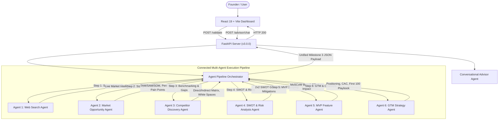

# VenturePulse — AI Startup Idea Validator & Market Intelligence Platform

[](LICENSE)
[](https://team-pulse-isb-7-3.vercel.app/)
[](https://team-pulse-isb7-3.onrender.com/)

**VenturePulse** is an autonomous multi-agent web platform designed to validate startup concepts, analyze market feasibility, compute TAM/SAM/SOM sizing bounds, benchmark competitor landscapes, synthesize SWOT/risk playbooks, prioritize MVP roadmaps, and generate actionable go-to-market intelligence in real-time. Built as part of **Infosys Springboard 7.0 (Batch 3) by Team Pulse**.

---

## 🚀 Live Deployments

Explore the live production environments of **VenturePulse** below:

| Deployment Component | Platform | URL Link | Status |
| :--- | :--- | :--- | :--- |
| **Frontend Dashboard Client** | [](https://team-pulse-isb-7-3.vercel.app/) | [https://team-pulse-isb-7-3.vercel.app](https://team-pulse-isb-7-3.vercel.app/) |  |
| **FastAPI Backend Web Service** | [](https://team-pulse-isb7-3.onrender.com/) | [https://team-pulse-isb7-3.onrender.com](https://team-pulse-isb7-3.onrender.com/) |  |
| **Interactive API Documentation** | [](https://team-pulse-isb7-3.onrender.com/docs) | [https://team-pulse-isb7-3.onrender.com/docs](https://team-pulse-isb7-3.onrender.com/docs) |  |

---

## Project Overview

Starting a business requires exhaustive market research, competitor benchmarking, risk mitigation, and go-to-market planning. This platform automates that process using a connected **Autonomous Multi-Agent Pipeline**:
1. **Founder inputs** startup concept, targeted industry vertical, and customer segment.
2. **Agent 1 (Web Search Agent)** queries real-time web search indices for competitor records and industry data.
3. **Agent 2 (Market Opportunity Agent)** extracts TAM/SAM/SOM market sizing, CAGR growth rates, buyer vs end-user personas, core pain points, and willingness to pay.
4. **Agent 3 (Competitor Discovery Agent)** maps direct and indirect players, builds an interactive Feature & Positioning Comparison Matrix, and surfaces unserved market white-spaces.
5. **Agent 4 (SWOT & Risk Analysis Agent)** generates structured SWOT vectors and multi-category risk assessments (Tech, Market, Legal, Financial) with actionable mitigations.
6. **Agent 5 (MVP Feature Recommendation Agent)** prioritizes core features using the MoSCoW framework (*Must-Have*, *Should-Have*, *Could-Have*, *Won't-Have*) and Effort vs Impact scoring.
7. **Agent 6 (Go-To-Market Strategy Agent)** formulates strategic positioning, customer acquisition channels with CAC estimates, and a "First 100 Customers" traction playbook.
8. **Agent 7 (Conversational Startup Advisor Agent)** engages in interactive, multi-turn consultation on unit economics, GTM execution, and defensibility.

---

## 🌟 Milestone 3 Core Features

* **6-Stage Autonomous Multi-Agent Pipeline**: Sequential DAG execution (`WebSearchAgent` $\rightarrow$ `MarketOpportunityAgent` $\rightarrow$ `CompetitorDiscoveryAgent` $\rightarrow$ `SWOTRiskAgent` $\rightarrow$ `MVPFeatureAgent` $\rightarrow$ `GTMStrategyAgent`).
* **SWOT & Risk Assessment Matrix**: Structured 2x2 SWOT grid with impact scoring and a comprehensive Risk Mitigation table with severity and probability metrics.
* **MVP Feature Prioritization (MoSCoW)**: Prioritizes core lean features into Must-Have, Should-Have, Could-Have, and Won't-Have categories with Effort vs. Impact (1-10) scores and a 30/60-day sprint roadmap.
* **Go-To-Market (GTM) Strategy & Traction**: Formulates value positioning statements, ranked acquisition channels with estimated CAC, and a tactical "First 100 Customers" action checklist.
* **Conversational AI Startup Advisor**: Context-aware multi-turn consultation endpoint (`POST /advisor/chat`) loaded with the validated startup dossier.
* **Resilient Multi-LLM Layer**: Seamless interoperability with Google Gemini, Groq, OpenAI REST APIs, and smart offline heuristic domain synthesis fallback.
* **Interactive React Dashboard**: Sleek tabbed interface with real-time agent execution visualizers, viability gauges, and pitch copilots.

---

## 🏗️ Multi-Agent Architecture



For complete technical specifications, see the [System Architecture Document](docs/system-architecture.md).

---

## 📁 Repository Structure

```
Team-Pulse-ISB7.3/
├── Backend/                       # Python FastAPI API Server (v3.0.0)
│   ├── services/                  # Multi-Agent Architecture
│   │   ├── search_service.py      # Agent 1: Web Search Agent (Tavily Index)
│   │   ├── market_agent.py        # Agent 2: Market Opportunity & Segmentation Agent
│   │   ├── competitor_agent.py    # Agent 3: Competitor Discovery & Comparison Agent
│   │   ├── swot_risk_agent.py     # Agent 4: SWOT & Risk Analysis Agent
│   │   ├── mvp_agent.py           # Agent 5: MVP Feature Recommendation Agent
│   │   ├── gtm_agent.py           # Agent 6: Go-To-Market Strategy Agent
│   │   ├── advisor_agent.py       # Agent 7: Conversational Startup Advisor Agent
│   │   ├── llm_service.py         # Universal Multi-LLM Adapter (Gemini/Groq/OpenAI/Fallback)
│   │   └── orchestrator.py        # Pipeline Orchestrator with Step Logging & Audit Trail
│   ├── test_pipeline.py           # Automated Test Suite for 3 Diverse Industry Concepts
│   ├── .env.example               # Environment variables template
│   ├── .gitignore                 # Backend-specific ignore file
│   ├── main.py                    # FastAPI routing, validations & CORS
│   └── requirements.txt           # Python backend dependencies
├── frontend/                      # React Client Application (Vite)
│   ├── src/                       # Source files
│   │   ├── App.css                # Milestone 3 Multi-Agent Dashboard Styles
│   │   ├── App.jsx                # Multi-Tab Analytics, SWOT, MoSCoW & GTM Views
│   │   ├── index.css              # Global typography & color tokens
│   │   └── main.jsx               # React root mount
│   ├── index.html                 # Entry HTML template
│   └── package.json               # Node dependencies and build scripts
├── docs/                          # Project documentation
│   └── system-architecture.md      # Architectural blueprint & Data Schemas
├── LICENSE                        # MIT Open-Source License
└── README.md                      # Project documentation index
```

---

## ⚡ Getting Started

### Prerequisites
* Python 3.8 or higher
* Node.js (v18 or higher) and npm

### 1. Setup & Run the Backend
Navigate to the `Backend` directory:
```bash
cd Backend
```

Install Python dependencies:
```bash
python -m pip install -r requirements.txt
```

*(Optional)* Configure API credentials in a `.env` file:
```env
TAVILY_API_KEY=tvly-your_tavily_key_here
GEMINI_API_KEY=your_gemini_key_here
```
*Note: If no API keys are specified, the application automatically runs in intelligent simulation fallback mode with 0 crashes.*

Run the automated test suite across 3 distinct industries (verifying all 6 connected agents):
```bash
python test_pipeline.py
```

Start the FastAPI server:
```bash
python -m uvicorn main:app --reload
```
API Swagger documentation is accessible at `http://127.0.0.1:8000/docs`.

### 2. Setup & Run the Frontend
Navigate to the `frontend` directory in a new terminal:
```bash
cd frontend
```

Install Node modules:
```bash
npm install
```

Start the Vite development server:
```bash
npm run dev
```
Open **`http://localhost:5173`** in your browser.

---

## 🧪 Validated Startup Concepts (Milestone 3 Test Cases)

The multi-agent pipeline has been verified on 3 diverse industry concepts:
1. **Pet Care & HealthTech**: *"An on-demand veterinary telehealth platform with instant AI triage and symptom detection from smartphone photos."*
2. **Green Logistics & Mobility**: *"An AI-powered route planning app for electric cargo bike deliveries in dense urban areas."*
3. **EdTech & Higher Education**: *"An intelligent learning copilot that converts college lectures and PDF textbooks into interactive flashcards, quizzes, and mock tests."*

---

## 👥 Team & Leadership

* **[Utkarsh Srivastav](https://github.com/UtkarshSrivastav09)** — **Team Lead & Full Stack Developer**

---

## 📄 License

This project is licensed under the **MIT License** — see the [LICENSE](LICENSE) file for details.

```
Copyright (c) 2026 Utkarsh Srivastav (Team Pulse) — VenturePulse
```

---

Developed by **Team Pulse** for Infosys Springboard 7.0 Batch 3.