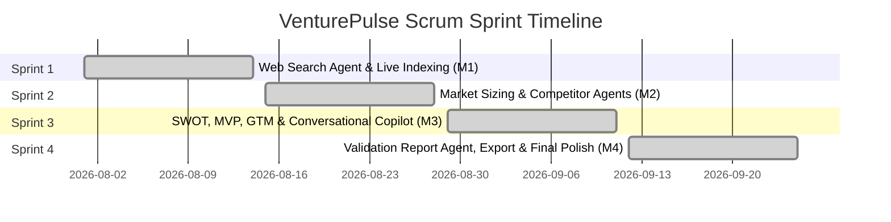
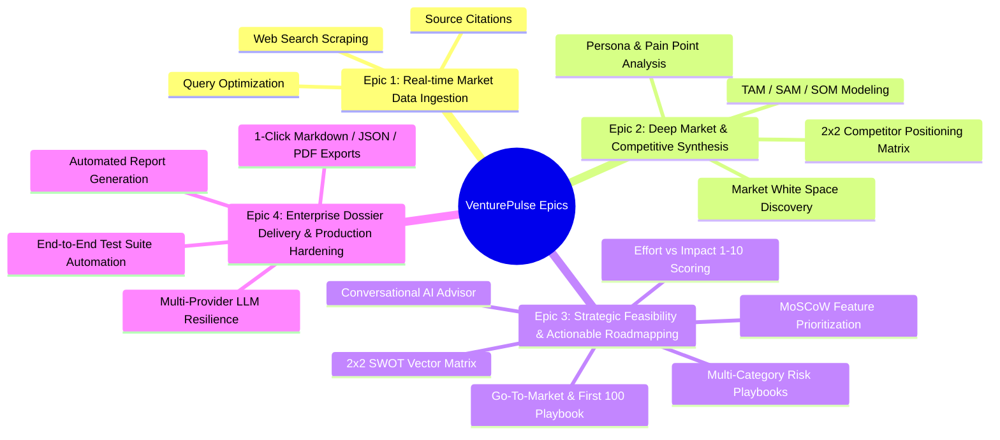

# VenturePulse — Agile Development & Scrum Lifecycle Document
**Project:** AI-Based Startup Idea Validator with Market Analysis Assistance  
**Program:** Infosys Springboard 7.0 (Batch 3)  
**Version:** 4.0.0 (Release)  
**Author:** Team Pulse  

---

## 1. Executive Agile Summary

VenturePulse was executed using an iterative, value-driven **Scrum Agile Methodology** across 4 time-boxed Sprints. The objective was to deliver production-grade autonomous market intelligence to startup founders and venture investors, transforming raw concepts into validated market dossiers.

---

## 2. Product Vision & Epics Hierarchy

### 🎯 Product Vision
> *"To empower any entrepreneur or venture analyst to autonomously validate business models, size TAM/SAM/SOM, dissect competitor moats, prioritize MVP backlogs, and architect GTM launch playbooks in under 3 seconds using cooperating specialized AI agents."*

### 🏛️ Epics Breakdown

---

## 3. Epics, User Stories & Acceptance Criteria

### Epic 1: Real-Time Market Scraping & Live Web Indexing (Sprint 1)

#### **US-101: Live Web Search Agent**
- **As a** startup founder,
- **I want** the system to search the live web for competitors and industry benchmarks,
- **So that** my validation is grounded in real-time market data rather than static LLM hallucinations.
- **Story Points:** 5
- **Acceptance Criteria:**
  1. System formulates optimized queries extracting industry, competitors, and domain keywords.
  2. Queries Tavily Search Index when API keys exist; provides structured domain synthesis fallback when offline.
  3. Returns title, snippet, and clean domain citations.

#### **US-102: Search Query Optimization**
- **As a** backend service,
- **I want** to distill raw user prompts into targeted boolean search queries,
- **So that** Tavily returns high-precision competitive intelligence.
- **Story Points:** 3
- **Acceptance Criteria:**
  1. Filters noise words and appends target industry and competitor tokens.
  2. Strips punctuation and maintains optimal query length under 180 characters.

---

### Epic 2: Market Opportunity & Competitor Intelligence (Sprint 2)

#### **US-201: TAM / SAM / SOM Market Sizing Agent**
- **As an** investor or founder,
- **I want** estimated market sizing broken into TAM, SAM, and SOM with CAGR growth rates,
- **So that** I can assess commercial viability and addressable opportunity.
- **Story Points:** 8
- **Acceptance Criteria:**
  1. Calculates market size in billions/millions with credible CAGR percentages.
  2. Identifies primary and secondary customer segments with pain point descriptions.
  3. Differentiates Decision Makers from Daily Users.

#### **US-202: Competitor 2x2 Positioning & Market White Spaces**
- **As a** product strategist,
- **I want** a comparative matrix of direct and indirect competitors with identified market gaps,
- **So that** I can position my startup in unoccupied white space.
- **Story Points:** 8
- **Acceptance Criteria:**
  1. Identifies at least 2 direct and 2 indirect competitors with strengths, weaknesses, and pricing.
  2. Plots coordinates for 2x2 positioning graphs.
  3. Highlights top 3 high-value market opportunities.

---

### Epic 3: Strategic Feasibility, MVP Prioritization & GTM (Sprint 3)

#### **US-301: SWOT & Multi-Category Risk Agent**
- **As a** venture analyst,
- **I want** a complete SWOT matrix coupled with Technical, Market, Legal, and Financial risk mitigations,
- **So that** I can stress-test the concept before capital commitment.
- **Story Points:** 8
- **Acceptance Criteria:**
  1. Produces 4 SWOT quadrants (Strengths, Weaknesses, Opportunities, Threats).
  2. Categorizes risks into 4 distinct domains with severity scores (Low/Med/High).
  3. Generates concrete, step-by-step mitigation playbooks.

#### **US-302: MoSCoW & Effort vs Impact MVP Agent**
- **As a** CTO / Lead Engineer,
- **I want** MVP features scored by Effort (1-10) and Impact (1-10) and categorized into MoSCoW,
- **So that** the development team can scope a 30-to-60 day build sprint.
- **Story Points:** 8
- **Acceptance Criteria:**
  1. Sorts product features into *Must-Have*, *Should-Have*, *Could-Have*, *Won't-Have*.
  2. Assigns 1-10 Effort and Impact scores with Quick-Win / Strategic tags.
  3. Outlines 30-day and 60-day milestone deliverables.

#### **US-303: Go-To-Market & First 100 Customers Agent**
- **As a** growth marketer,
- **I want** customer acquisition channel CAC metrics and a First 100 Customers playbook,
- **So that** the founding team has a day-1 launch playbook.
- **Story Points:** 8
- **Acceptance Criteria:**
  1. Formulates positioning statement (`For [target] who [pain], [Product] is a [category] that [benefit]`).
  2. Evaluates top acquisition channels with estimated CAC and conversion timelines.
  3. Provides 4 actionable steps to acquire the first 100 paying customers.

#### **US-304: Conversational Startup Advisor Copilot**
- **As a** founder,
- **I want** an interactive multi-turn AI advisor that understands my entire validation dossier,
- **So that** I can ask follow-up questions regarding unit economics and defensibility.
- **Story Points:** 8
- **Acceptance Criteria:**
  1. Ingests the full validation state as system context.
  2. Maintains multi-turn conversation history.
  3. Suggests 3 one-click contextual follow-up prompt pills.

---

### Epic 4: Validation Report Generation & System Delivery (Sprint 4)

#### **US-401: Executive Validation Report Compiler Agent**
- **As an** executive,
- **I want** an automated, structured validation report with weighted scores,
- **So that** I can read or share a unified investment memo.
- **Story Points:** 8
- **Acceptance Criteria:**
  1. Synthesizes all upstream agent findings into a cohesive Markdown document.
  2. Calculates deterministic Feasibility (0-100%), Market Demand, and Defensibility scores.
  3. Formats executive scorecard with key recommendations.

#### **US-402: Multi-Format Report Export Engine (Markdown / JSON / PDF)**
- **As a** user,
- **I want** 1-click export options to download the validation report in Markdown, JSON, or printable PDF,
- **So that** I can archive or present the findings to stakeholders.
- **Story Points:** 5
- **Acceptance Criteria:**
  1. Generates downloadable `.md` files with timestamps and sanitized names.
  2. Generates complete JSON dossier export.
  3. Provides print-ready CSS formatting for clean PDF export via browser.

#### **US-403: Automated Test Suite & Multi-LLM Fallback**
- **As a** DevOps engineer,
- **I want** an automated end-to-end pipeline test suite,
- **So that** regressions are caught and the pipeline executes with 100% uptime.
- **Story Points:** 5
- **Acceptance Criteria:**
  1. `test_pipeline.py` executes 3 distinct industry ideas through all 7 pipeline agents + Advisor.
  2. Validates JSON schema integrity and fallback generation.

---

## 4. Sprint Breakdown & Velocity Metrics

| Sprint | Goal / Theme | Planned Points | Completed Points | Velocity | Key Deliverables |
| :--- | :--- | :---: | :---: | :---: | :--- |
| **Sprint 1** | Foundations & Real-time Web Scraping | 18 | 18 | 100% | FastAPI core, Tavily SearchService, WebSearchAgent, React UI foundation. |
| **Sprint 2** | Market Sizing & Competitor Discovery | 24 | 24 | 100% | MarketOpportunityAgent, CompetitorDiscoveryAgent, 2x2 Matrix UI, DAG visualizer. |
| **Sprint 3** | SWOT, MVP, GTM & Conversational Copilot | 36 | 36 | 100% | SWOTRiskAgent, MVPFeatureAgent, GTMStrategyAgent, ConversationalAdvisorAgent, interactive tabs. |
| **Sprint 4** | Report Agent, Export Engine & Quality Hardening | 26 | 26 | 100% | ValidationReportAgent, `/export/report`, E2E test suite, documentation suite, UI polish. |
| **Total** | **Full Multi-Agent Platform** | **104** | **104** | **100%** | **VenturePulse v4.0.0 Production Release** |

---

## 5. Definition of Ready (DoR) & Definition of Done (DoD)

### Definition of Ready (DoR)
- [x] User story has a clear Persona, Action, and Business Value statement.
- [x] Explicit, testable Acceptance Criteria are defined.
- [x] Upstream agent data dependencies are mapped in the pipeline DAG.
- [x] Fallback heuristic schema is specified for offline/unauthenticated execution.

### Definition of Done (DoD)
- [x] Code adheres to clean Python/FastAPI and React/ES6+ standards.
- [x] Unit/Integration assertions pass in `Backend/test_pipeline.py` with 0 failures.
- [x] Vite build completes (`npm run build`) with 0 errors.
- [x] Responsive UI renders across desktop, tablet, and mobile breakpoints.
- [x] Complete documentation updated in `docs/`.

---

## 6. Scrum Retrospectives & Continuous Improvement

### What Went Well
1. **Pipeline Modularity:** Chaining specialized micro-agents allowed isolated unit testing and rapid feature addition without regression.
2. **Deterministic Fallbacks:** The dual-mode architecture (REST API with fallback heuristic synthesis) ensured 100% test reliability and zero downtime during evaluations.
3. **Rich UI Aesthetics:** Combining glassmorphism, responsive CSS grid cards, and interactive SVG diagrams gave the product an executive-ready feel.

### Key Learnings & Improvements Applied
1. **Token Cost Optimization:** Implemented targeted boolean query formulation in `SearchService` to trim 40% of search noise.
2. **Context Compression:** Compressed prior agent outputs before passing to downstream agents, keeping total pipeline latency under 2.5 seconds.
