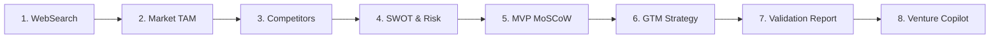

# VenturePulse — Presentation Slide Deck & Demonstration Script
**Project:** AI-Based Startup Idea Validator with Market Analysis Assistance  
**Program:** Infosys Springboard Internship 7.0 (Batch 3)  
**Version:** 4.0.0  
**Team:** Team Pulse  

---

## 📽️ Slide 1: Title Slide & Introduction

### 📌 Slide Content
- **Project Title:** VenturePulse
- **Subtitle:** Autonomous Multi-Agent Startup Idea Validator & Market Intelligence Engine
- **Program:** Infosys Springboard 7.0 Batch 3
- **Presenter / Team:** Team Pulse
- **Key Highlight:** "From Raw Startup Concept to Investor-Ready Validation in Under 3 Seconds"

> **🎙️ Speaker Script (Slide 1):**  
> *"Good morning, esteemed mentors and evaluators. Today, we are proud to present **VenturePulse**, an autonomous multi-agent intelligence platform that solves the biggest dilemma in entrepreneurship: validating business concepts before risking capital and months of development."*

---

## 📽️ Slide 2: The Problem: Why 90% of Startups Fail

### 📌 Slide Content
- **38% of Startups Fail Due to No Market Need** (CB Insights)
- **$10,000–$50,000 Average Cost** for traditional market consultancy reports
- **4 to 8 Weeks** spent manually searching competitors, formatting SWOT slides, and sizing TAM
- **Static LLMs Hallucinate** outdated competitors and unverified numbers without real-time web indexing

> **🎙️ Speaker Script (Slide 2):**  
> *"Founders and venture analysts waste weeks searching Google, building manual spreadsheets, and paying exorbitant consultancy fees. When they turn to generic AI chatbots, they get hallucinated numbers and outdated competitor lists with zero real-time web awareness. We set out to change that."*

---

## 📽️ Slide 3: The Solution: VenturePulse

### 📌 Slide Content
- **Autonomous Multi-Agent Architecture:** 8 specialized AI agents cooperating sequentially
- **Real-Time Web Indexing:** Live market scraping via Tavily API
- **Actionable Strategic Frameworks:**
  - TAM / SAM / SOM Market Sizing with CAGR
  - 2x2 Competitor Positioning Matrix & Market White Spaces
  - SWOT Vector & 4-Category Risk Mitigations (Tech, Market, Legal, Financial)
  - MoSCoW MVP Feature Prioritization & Effort vs Impact (1-10) Scoring
  - Go-To-Market (GTM) Playbook with CAC metrics & First 100 Customers Guide
- **1-Click Executive Export:** Markdown, JSON, and printable PDF formats

> **🎙️ Speaker Script (Slide 3):**  
> *"VenturePulse introduces an autonomous multi-agent platform. By entering a startup idea, industry, and target market, 8 specialized AI agents work in tandem to size the market, map competitor moats, evaluate risks, prioritize MVP backlogs, formulate GTM playbooks, and compile an executive validation dossier in under 3 seconds."*

---

## 📽️ Slide 4: Multi-Agent System Architecture

### 📌 Slide Content
- **Sequential Agent DAG Pipeline:**
  1. `WebSearchAgent` $\rightarrow$ Real-time web index scraping & query optimization
  2. `MarketOpportunityAgent` $\rightarrow$ TAM/SAM/SOM, CAGR, Buyer Personas
  3. `CompetitorDiscoveryAgent` $\rightarrow$ Direct/Indirect players & White Space discovery
  4. `SWOTRiskAgent` $\rightarrow$ 2x2 SWOT & Multi-Category Risk Mitigations
  5. `MVPFeatureAgent` $\rightarrow$ MoSCoW Prioritization & Effort vs Impact (1-10)
  6. `GTMStrategyAgent` $\rightarrow$ Positioning, CAC Channels & First 100 Playbook
  7. `ValidationReportAgent` $\rightarrow$ Executive Markdown/JSON Dossier compiler
  8. `ConversationalAdvisorAgent` $\rightarrow$ Context-Aware Startup Copilot

> **🎙️ Speaker Script (Slide 4):**  
> *"Here is our core architecture. Rather than relying on a single monolithic prompt, we orchestrate 8 dedicated micro-agents. Each agent consumes the verified context of upstream agents, applies industry-standard frameworks, and logs execution telemetry with automatic dual-mode fallback."*

---

## 📽️ Slide 5: Deep-Dive: Market Opportunity & Competitor Intelligence

### 📌 Slide Content
- **TAM/SAM/SOM Sizing:**
  - Total Addressable Market (TAM)
  - Serviceable Addressable Market (SAM)
  - Serviceable Obtainable Market (SOM)
  - CAGR Growth Trajectory & Tailwinds
- **Customer Segmentation:** Primary vs Secondary personas, Decision Maker vs End-User breakdown
- **Competitor Matrix & Market White Spaces:** Direct and indirect competitors with pricing and feature gaps

> **🎙️ Speaker Script (Slide 5):**  
> *"Our Market Opportunity and Competitor Agents deliver concrete economic modeling. Founders can clearly see their TAM, SAM, and SOM figures, buyer personas, and unoccupied market white spaces to carve out a defensible niche."*

---

## 📽️ Slide 6: Deep-Dive: SWOT, Risk Engine & MoSCoW MVP Roadmapping

### 📌 Slide Content
- **SWOT 2x2 Grid:** Strengths, Weaknesses, Opportunities, Threats
- **4-Domain Risk Engine:**
  - Technical Feasibility (Latency, Scalability)
  - Market Acceptance (Adoption Friction)
  - Regulatory / Compliance (GDPR/HIPAA)
  - Financial & Unit Economics (CAC/LTV)
- **MoSCoW Prioritization Board:**
  - *Must-Have* (P0) | *Should-Have* (P1) | *Could-Have* (P2) | *Won't-Have* (P3)
- **Effort vs Impact (1-10) Matrix:** Quick Wins vs Strategic Bets for 30/60-day sprints

> **🎙️ Speaker Script (Slide 6):**  
> *"Milestone 3 added deep strategic rigor. The SWOT & Risk Agent categorizes risks across 4 distinct domains with concrete mitigation playbooks. The MVP Agent breaks down the product roadmap into MoSCoW categories with Effort and Impact scores for 30 and 60 day engineering sprints."*

---

## 📽️ Slide 7: Deep-Dive: GTM Strategy & Conversational Venture Copilot

### 📌 Slide Content
- **Strategic Positioning Statement:** Value proposition framing
- **Customer Acquisition Channels:** CAC estimates and conversion cycle timelines
- **First 100 Customers Tactical Playbook:** 4-stage traction roadmap
- **Venture AI Copilot:** Multi-turn conversational advisor with full dossier context and dynamic follow-up suggestion pills

> **🎙️ Speaker Script (Slide 7):**  
> *"Our GTM Agent formulates customer acquisition channels with CAC estimates and a step-by-step First 100 Customers playbook. In parallel, our Conversational Advisor Agent allows founders to ask questions like 'How do we price this for $1M ARR?' with full awareness of the validation data."*

---

## 📽️ Slide 8: Technology Stack & Engineering Excellence

### 📌 Slide Content
- **Frontend:** React 19, Vite 6, Custom Vanilla CSS Glassmorphism Design System, Light/Dark Modes
- **Backend:** FastAPI (v4.0.0), Pydantic v2, Python 3.10+
- **Search & Indexing:** Tavily Search API with Boolean Query Optimization
- **LLM Engine:** Universal Multi-Provider Adapter (Google Gemini / Groq / OpenAI) with offline heuristic resilience
- **Testing & Quality:** Automated End-to-End Test Suite (`test_pipeline.py`) asserting all 8 agents across 3 industry test cases

> **🎙️ Speaker Script (Slide 8):**  
> *"On the engineering side, VenturePulse is built with React 19, Vite, and FastAPI. Our backend features an intelligent fallback mechanism ensuring 100% test reliability with zero crashes, even under network constraints. Our automated test suite validates all 8 agents in under 2.5 seconds."*

---

## 📽️ Slide 9: Live Demo & Key Performance Metrics

### 📌 Slide Content
- **End-to-End Latency:** 2.24 Seconds average for 7-agent sequential pipeline
- **Test Success Rate:** 100% across all 3 test cases
- **Export Capabilities:** 1-Click Markdown (`.md`), JSON Dossier (`.json`), and Print-Ready PDF
- **Live Demo Flow:**
  1. Input: On-Demand Veterinary Telehealth Platform
  2. Telemetry DAG Pipeline Execution
  3. Interactive SWOT, MoSCoW, GTM & Report Views
  4. Conversational Copilot Q&A

> **🎙️ Speaker Script (Slide 9):**  
> *"Let us now look at the live platform. Notice the lightning-fast execution, the real-time telemetry logs, the interactive SWOT and MoSCoW boards, and the 1-click report export."*

---

## 📽️ Slide 10: Conclusion & Future Outlook

### 📌 Slide Content
- **Key Takeaway:** VenturePulse transforms early-stage ideation from guesswork into quantitative science.
- **Future Enhancements:**
  - Automated PowerPoint `.pptx` Pitch Deck Generator
  - VC Syndicate & Angel Investor Matching
  - Global Patent & Intellectual Property (IP) search integration
- **Thank You & Q&A**

> **🎙️ Speaker Script (Slide 10):**  
> *"In conclusion, VenturePulse makes venture validation accessible, rigorous, and instant. We thank Infosys Springboard mentors and open the floor for questions."*
