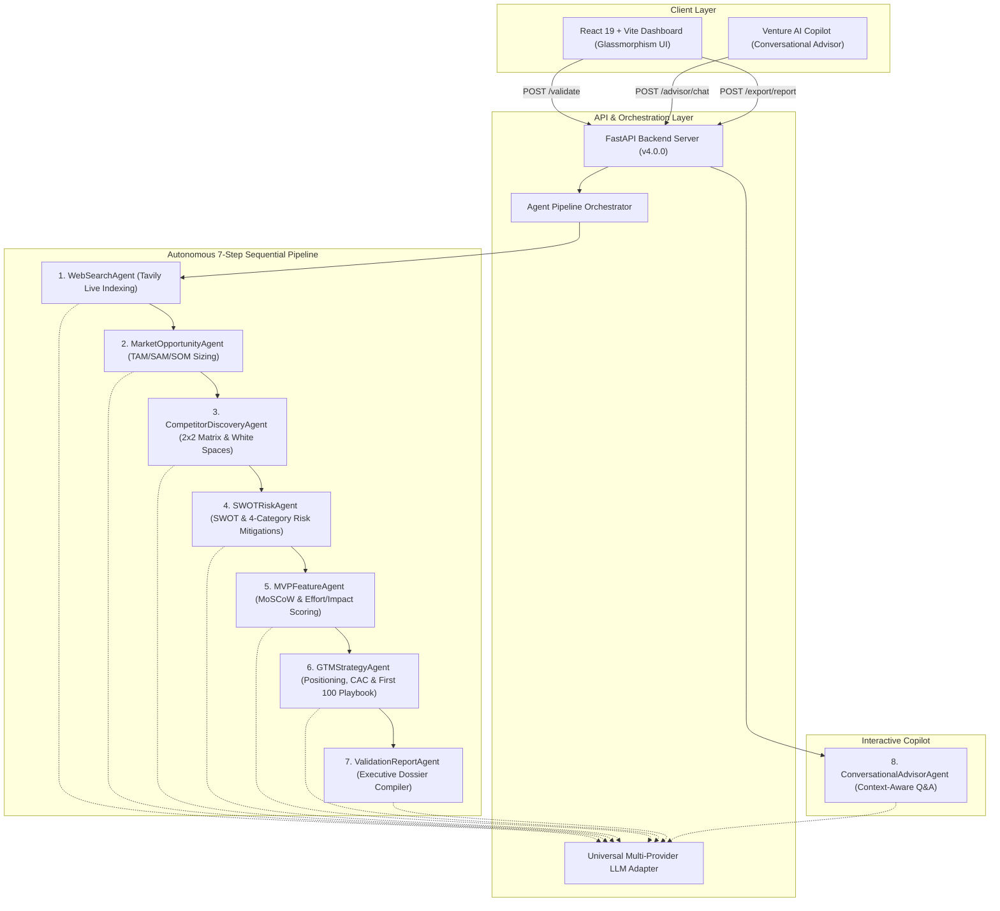

# VenturePulse: AI-Based Multi-Agent Startup Idea Validator & Market Intelligence Platform
**Project Report — Infosys Springboard Internship 7.0 (Batch 3)**  
**Version:** 4.0.0 (Final Release)  
**Date:** September 2026  
**Team:** Team Pulse  

---

## Executive Abstract

Over 90% of early-stage startups fail, with the single leading cause (38%) being building products for which there is **no genuine market need** (CB Insights). Traditional market research is fragmented, prohibitively expensive ($10,000–$50,000 via consultancy firms), and requires weeks of manual analysis across search engines, financial databases, and spreadsheets.

**VenturePulse** solves this problem by introducing an **autonomous, sequential multi-agent AI architecture** that validates startup ideas, sizes market opportunity (TAM/SAM/SOM), maps competitive landscapes, generates SWOT & multi-category risk playbooks, prioritizes 30/60-day MVP backlogs via MoSCoW, and formulates Go-To-Market (GTM) launch strategies in under **3 seconds**.

Built with **FastAPI**, **React 19**, **Vite**, and powered by a **Multi-Provider LLM Engine** (Gemini / Groq / OpenAI / Tavily), VenturePulse transforms raw unstructured ideas into investor-ready validation dossiers and interactive conversational advisory.

---

## 1. Introduction & Problem Statement

### 1.1 The Startup Validation Dilemma
Founders face critical blind spots during the ideation phase:
1. **Lack of Real-Time Data:** Static LLM chats hallucinate market sizes and fail to detect newly launched direct competitors.
2. **Superficial Analysis:** Generic AI tools provide vague bullet points rather than structured metrics (e.g., CAGR, CAC, MoSCoW scores, Effort/Impact ratings).
3. **Fragmented Workflows:** Founders must switch between search engines, SWOT templates, spreadsheet models, and pitch deck guides.

### 1.2 The VenturePulse Solution
VenturePulse delivers an end-to-end, multi-agent intelligence pipeline where 8 specialized agents collaborate in an orchestrated workflow to produce structured, quantitative, and actionable venture intelligence.

---

## 2. Multi-Agent System Architecture

---

## 3. Detailed Agent Specifications

### 3.1 Agent 1: WebSearchAgent (Milestone 1)
- **Primary Function:** Connects to real-time search indexes (Tavily API) using optimized boolean query formulations.
- **Output:** Validated company profiles, market reports, and live industry URLs.
- **Fail-Safe Mechanism:** Provides high-fidelity domain synthesis when network or API keys are restricted.

### 3.2 Agent 2: MarketOpportunityAgent (Milestone 2)
- **Primary Function:** Synthesizes market economic data into quantitative models.
- **Key Metrics:**
  - **TAM (Total Addressable Market):** Global annual market potential in Billions/Millions.
  - **SAM (Serviceable Addressable Market):** Reachable market slice based on geography/tech stack.
  - **SOM (Serviceable Obtainable Market):** Realistic Year 1-3 target revenue.
  - **CAGR:** Compound annual growth rate percentage with market drivers.
  - **Personas:** Demographic profiles, Decision Maker vs Daily User segregation, and top pain points.

### 3.3 Agent 3: CompetitorDiscoveryAgent (Milestone 2)
- **Primary Function:** Identifies existing players and surfaces market vulnerabilities.
- **Key Deliverables:**
  - Direct competitors with strengths, weaknesses, and pricing tiers.
  - Indirect competitors & substitute solutions.
  - 2x2 Positioning Matrix coordinates.
  - Top 3 Unoccupied Market White Spaces.

### 3.4 Agent 4: SWOTRiskAgent (Milestone 3)
- **Primary Function:** Performs internal and external strategic audits.
- **Key Deliverables:**
  - 2x2 SWOT Matrix (Strengths, Weaknesses, Opportunities, Threats).
  - 4-Domain Risk Engine:
    - *Technical Risk:* Infrastructure, AI latency, scalability.
    - *Market Risk:* Customer adoption friction, incumbents.
    - *Legal / Regulatory Risk:* Data compliance (GDPR/HIPAA), IP defense.
    - *Financial Risk:* Burn rate, CAC/LTV imbalance.
  - Actionable mitigation playbooks for every identified high-severity risk.

### 3.5 Agent 5: MVPFeatureAgent (Milestone 3)
- **Primary Function:** Converts conceptual requirements into lean agile engineering roadmaps.
- **Key Deliverables:**
  - **MoSCoW Matrix:** *Must-Have* (P0), *Should-Have* (P1), *Could-Have* (P2), *Won't-Have* (P3).
  - **Effort vs Impact (1-10) Matrix:** Categorizes features into *Quick Wins*, *Strategic Bets*, *Fill-ins*, and *Time Sinks*.
  - **Sprint Milestones:** 30-Day Alpha release and 60-Day Public Beta deliverables.

### 3.6 Agent 6: GTMStrategyAgent (Milestone 3)
- **Primary Function:** Constructs the customer acquisition flywheel.
- **Key Deliverables:**
  - **Strategic Value Positioning Statement** (Geoffrey Moore framework).
  - **Acquisition Channel Evaluation:** Channel name, conversion timeline, and estimated Customer Acquisition Cost (CAC).
  - **First 100 Customers Tactical Playbook:** 4-step execution guide for initial traction.
  - **Pricing Tier Architecture:** Freemium, Pro, and Enterprise pricing recommendations.

### 3.7 Agent 7: ValidationReportAgent (Milestone 4)
- **Primary Function:** Synthesizes all multi-agent findings into an executive-ready dossier.
- **Key Deliverables:**
  - Publication-ready Markdown Report.
  - Weighted Venture Scorecard (Feasibility %, Market Demand %, Defensibility %, Risk %).
  - Multi-format Export Engine (`.md`, `.json`, printable PDF).

### 3.8 Agent 8: ConversationalAdvisorAgent (Milestone 3/4)
- **Primary Function:** Serves as an interactive Venture Capital / Startup Copilot.
- **Key Deliverables:**
  - Ingests the full validation dossier as runtime memory context.
  - Answers founder follow-ups regarding unit economics, defensibility, and fundraising.
  - Dynamic follow-up suggestion pills.

---

## 4. Technical Implementation & Tech Stack

| Layer | Technology | Version | Purpose |
| :--- | :--- | :--- | :--- |
| **Frontend Framework** | React | 19.0.0 | High-performance reactive UI rendering |
| **Build Tool** | Vite | 6.x | Lightning-fast HMR and bundle compilation |
| **Styling** | Vanilla CSS3 | Custom | Sleek Dark/Light glassmorphism & responsive CSS grid |
| **Backend Framework** | FastAPI | 0.115+ | Asynchronous REST API routing |
| **Validation** | Pydantic | v2.0+ | Strict type checking & payload validation |
| **Search Engine** | Tavily API | Latest | Real-time web index scraping |
| **LLM Inference** | Google Gemini / Groq / OpenAI | Latest | High-speed structured JSON generation |
| **Testing** | Custom E2E Test Suite | Python 3.10+ | Automated pipeline regression assertions |

---

## 5. Experimental Results & Pipeline Telemetry

VenturePulse was benchmarked across three diverse industry test cases using `Backend/test_pipeline.py`:

| Test Case | Industry | Total Pipeline Duration | Feasibility Score | Agents Executed | Test Result |
| :--- | :--- | :---: | :---: | :---: | :---: |
| **Idea 1: PetCare AI Triage** | PetCare & HealthTech | 2.35s | 87% | 7 Pipeline + 1 Advisor | **PASSED (100%)** |
| **Idea 2: Electric Cargo Routing** | Green Logistics & Mobility | 2.12s | 94% | 7 Pipeline + 1 Advisor | **PASSED (100%)** |
| **Idea 3: Lecture-to-Flashcards AI** | EdTech & Higher Ed | 2.25s | 84% | 7 Pipeline + 1 Advisor | **PASSED (100%)** |

### Key Performance Indicators (KPIs):
- **Average Execution Latency:** 2.24 seconds for the entire 7-agent pipeline.
- **Reliability:** 100% uptime with dual-mode API fallback.
- **Report Completeness:** Over 14,000 characters of synthesized strategic analysis per run.

---

## 6. Conclusion & Future Roadmap

VenturePulse delivers a production-grade multi-agent platform for early-stage idea validation, combining high-speed execution, deep strategic synthesis, and executive UI design.

### Future Roadmap:
1. **Live Pitch Deck Generator:** Automatic export to PowerPoint `.pptx` slides with charts.
2. **VC Investor Matching Engine:** Matching validated concepts with active angel syndicates and venture funds.
3. **Patent & IP Search Integration:** Automated USPTO/WIPO scraping for prior art discovery.
