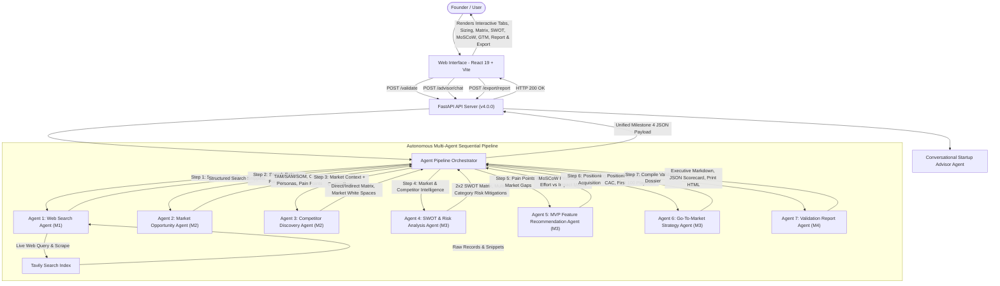

# VenturePulse System Architecture — Multi-Agent Intelligence Pipeline (v4.0.0)

This document outlines the multi-agent system architecture, component roles, orchestration pipeline, and data schemas for **VenturePulse** (AI-Based Startup Idea Validator with Market Analysis Assistance — Infosys Springboard 7.0 Batch 3).

---

## 🏗️ Multi-Agent Architecture Flow



---

## 🤖 Component Roles & Agent Responsibilities

| Agent / Component | Milestone | Role | Description |
| :--- | :--- | :--- | :--- |
| **Frontend Client** | M1–M4 | User Interface & Analytics | React + Vite client featuring real-time DAG visualizers, TAM/SAM/SOM calculators, 2x2 competitor matrices, interactive SWOT grids, MoSCoW boards, GTM playbooks, Executive Report views, Markdown/JSON/PDF exports, and Venture Copilot. |
| **FastAPI Backend** | M1–M4 | API Routing & Validation | Exposes `/validate`, `/advisor/chat`, `/export/report`, `/search`, `/agents`, and `/health` endpoints with CORS and Pydantic validation. |
| **Agent Pipeline Orchestrator** | M1–M4 | Pipeline Coordination | Sequentially executes WSA $\rightarrow$ MOA $\rightarrow$ CCA $\rightarrow$ SRA $\rightarrow$ MVPA $\rightarrow$ GTMA $\rightarrow$ VRA, logging step telemetry, schema normalization, and error fallbacks. |
| **Web Search Agent (`WSA`)** | M1 | Web Intelligence Scraping | Queries real-time search indices for competitors, market trends, and live industry records. |
| **Market Opportunity Agent (`MOA`)** | M2 | Market Sizing & Segmentation | Extracts TAM/SAM/SOM estimates, CAGR growth rate, customer buyer personas, decision makers vs users, and core pain points. |
| **Competitor Discovery Agent (`CCA`)** | M2 | Benchmarking & White Space | Identifies direct and indirect competitors, creates feature/positioning comparison matrices, and surfaces high-value market gaps. |
| **SWOT & Risk Analysis Agent (`SRA`)** | M3 | Strategic Audit & Risk Mitigation | Generates internal strengths/weaknesses, external opportunities/threats, and multi-category risk assessments (Tech, Market, Legal, Financial) with actionable mitigation playbooks. |
| **MVP Feature Recommendation Agent (`MVPA`)** | M3 | Product Scoping & MoSCoW | Prioritizes core features using the MoSCoW framework (*Must-Have*, *Should-Have*, *Could-Have*, *Won't-Have*), Effort vs Impact (1-10) scoring, and 30/60-day sprint milestones. |
| **Go-To-Market Strategy Agent (`GTMA`)** | M3 | Growth & Acquisition Flywheel | Formulates strategic positioning statements, customer acquisition channels with estimated CAC, First 100 Customers tactical playbooks, and SaaS pricing tier ladders. |
| **Validation Report Agent (`VRA`)** | M4 | Executive Synthesis & Export | Synthesizes all agent outputs into publication-ready Executive Validation Reports in Markdown, JSON, and printable formats. |
| **Conversational Advisor Agent (`CAA`)** | M3/M4 | Multi-Turn Advisory Q&A | Provides interactive, context-aware founder consultation on unit economics, GTM execution, and defensibility against Big Tech. |
| **Universal LLM Adapter** | M2–M4 | AI Model Interoperability | Connects to Google Gemini, Groq, or OpenAI with automatic fallback and local domain synthesis when offline. |

---

## 📋 Data Schemas

### 1. Request Schema (`POST /validate`)
```json
{
  "startup_idea": "An on-demand veterinary telehealth platform with instant AI triage and symptom detection from smartphone photos.",
  "industry": "Pet Care & HealthTech",
  "target_market": "Pet owners, veterinary clinics"
}
```

### 2. Conversational Advisor Request Schema (`POST /advisor/chat`)
```json
{
  "message": "How should I price this to maximize Year-1 ARR?",
  "history": [],
  "validation_context": { ... }
}
```

### 3. Response Schema (Milestone 3 Unified Payload)
```json
{
  "startup_idea": "An on-demand veterinary telehealth platform...",
  "industry": "Pet Care & HealthTech",
  "target_market": "Pet owners, veterinary clinics",
  "pipeline_metadata": {
    "total_duration_sec": 1.99,
    "pipeline_version": "3.0.0",
    "agents_executed": [
      "WebSearchAgent",
      "MarketOpportunityAgent",
      "CompetitorDiscoveryAgent",
      "SWOTRiskAgent",
      "MVPFeatureAgent",
      "GTMStrategyAgent"
    ],
    "execution_logs": [ ... ]
  },
  "market_analysis": {
    "market_summary": "High-impact overview...",
    "market_size_and_growth": {
      "tam_estimate": "$42.5 Billion Global Market",
      "sam_estimate": "$6.8 Billion Regional / Dedicated Segment",
      "som_estimate": "$340 Million Beachhead Market",
      "cagr_growth_rate": "14.2% CAGR (2024-2030)",
      "growth_stage": "High Growth"
    },
    "customer_segments": [ ... ]
  },
  "competitor_analysis": {
    "competitor_summary": "Overview of direct vs indirect competitive landscape...",
    "direct_competitors": [ ... ],
    "comparison_matrix": { ... },
    "market_gaps_and_white_space": [ ... ]
  },
  "swot_analysis": {
    "swot_summary": "Executive summary of strategic positioning...",
    "swot": {
      "strengths": [ ... ],
      "weaknesses": [ ... ],
      "opportunities": [ ... ],
      "threats": [ ... ]
    },
    "risk_assessment": [
      {
        "category": "Technical & Operational Feasibility",
        "risk_title": "Model hallucination or inaccurate symptom classification",
        "severity": "Medium",
        "probability": "Low",
        "mitigation_strategy": "Implement confidence scoring thresholds with instant routing to licensed vets."
      }
    ],
    "overall_risk_score": 26,
    "risk_verdict": "Low-to-Moderate Risk — High Feasibility"
  },
  "mvp_roadmap": {
    "mvp_philosophy": "Lean build strategy focusing on Must-Have loops...",
    "moscow_matrix": {
      "must_have": [ ... ],
      "should_have": [ ... ],
      "could_have": [ ... ],
      "wont_have_v1": [ ... ]
    },
    "sprint_roadmap": {
      "phase_1_30_days": "...",
      "phase_2_60_days": "..."
    },
    "estimated_mvp_build_time_weeks": 6,
    "recommended_tech_stack": [ ... ]
  },
  "gtm_strategy": {
    "gtm_executive_summary": "Product-led growth flywheel combined with targeted outbound...",
    "positioning_statement": {
      "for_target": "...",
      "who_struggle_with": "...",
      "our_solution_is": "...",
      "that_delivers": "...",
      "unlike_competitors": "..."
    },
    "acquisition_channels": [ ... ],
    "first_100_customers_playbook": [ ... ],
    "phased_launch_roadmap": [ ... ],
    "pricing_and_monetization_strategy": { ... }
  },
  "search_data": {
    "query": "...",
    "answer": "...",
    "results": [],
    "mode": "live"
  }
}
```
