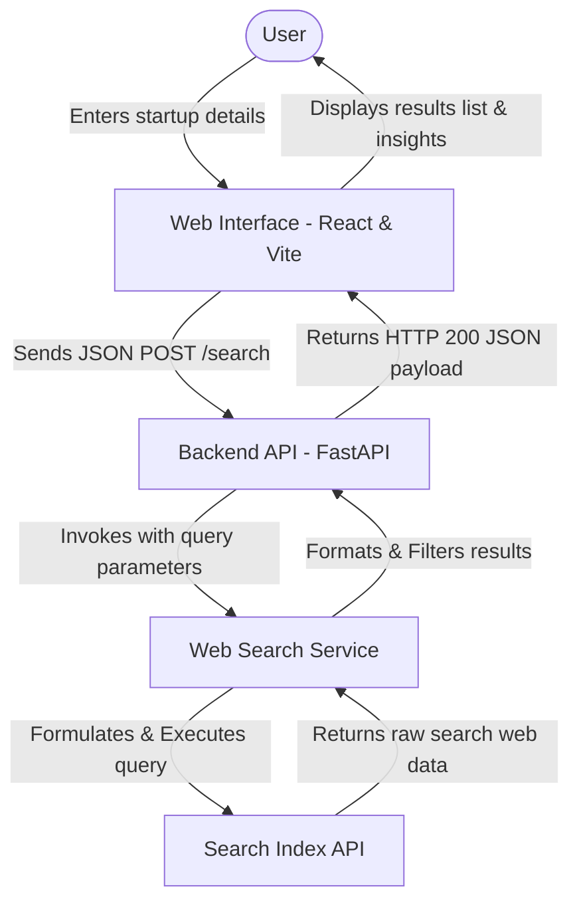

# System Architecture

This document outlines the system architecture, component roles, and data flow for the **Development of AI Based Startup Idea Validator with Market Analysis Assistance** project.

## Architecture Flow

The following diagram illustrates the end-to-end data flow:



## Component Roles & Responsibilities

| Component | Role | Description |
| :--- | :--- | :--- |
| **Frontend** | Collect details & display results | A React + Vite single page application that provides a clean user interface. It collects startup name, industry, target market, and description, communicates with the backend, and displays the structured results. |
| **Backend API** | Orchestration | A Python FastAPI server that exposes a `/search` endpoint, manages CORS, handles validation, calls the search service, and returns the response. |
| **Web Search Service** | Search Query Formulation | A specialized Python service responsible for compiling search queries from startup parameters and communicating with the search API. |
| **Search Index API** | Web Search Engine | External search engine specialized in returning clean web results, titles, snippets, and answers. |

## Data Schemas

### Request Schema (`POST /search`)
```json
{
  "startup_idea": "AI-based food delivery for college students",
  "industry": "Food Technology",
  "target_market": "College students"
}
```

### Response Schema
```json
{
  "startup_idea": "AI-based food delivery for college students",
  "results": [
    {
      "title": "Example Competitor A",
      "url": "https://competitor-a.com",
      "content": "Description of Competitor A's offering and services...",
      "score": 0.95
    }
  ]
}
```
