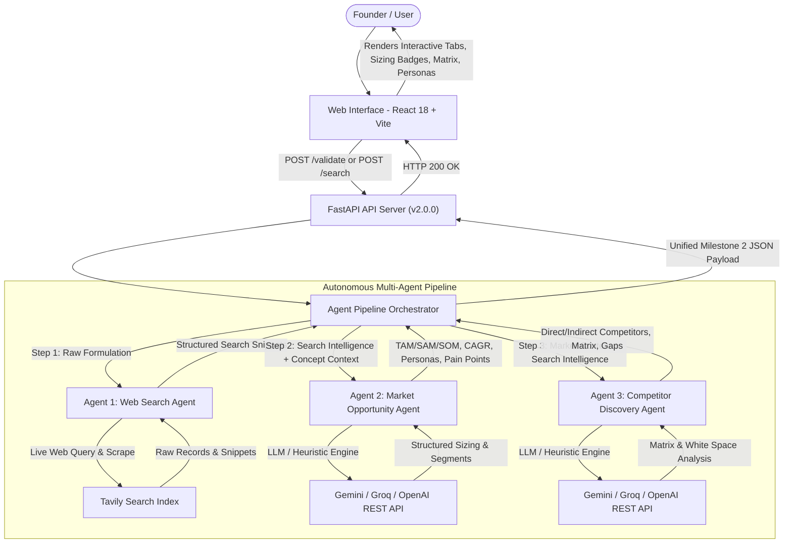

# VenturePulse System Architecture — Multi-Agent Intelligence Pipeline

This document outlines the multi-agent system architecture, component roles, orchestration pipeline, and data schemas for **VenturePulse** (AI-Based Startup Idea Validator with Market Analysis Assistance).

---

## 🏗️ Multi-Agent Architecture Flow



---

## 🤖 Component Roles & Agent Responsibilities

| Agent / Component | Milestone | Role | Description |
| :--- | :--- | :--- | :--- |
| **Frontend Client** | M1 & M2 | User Interface & Analytics | React + Vite client featuring real-time pipeline visualizers, TAM/SAM/SOM sizing cards, persona breakdowns, interactive competitor matrices, and pitch copilots. |
| **FastAPI Backend** | M1 & M2 | API Routing & Validation | Exposes `/validate`, `/search`, `/agents`, and `/health` endpoints with CORS and Pydantic validation. |
| **Agent Pipeline Orchestrator** | M2 | Pipeline Coordination | Sequentially executes WSA $\rightarrow$ MOA $\rightarrow$ CCA, logging step metrics, verifying schemas, and handling fallback gracefully. |
| **Web Search Agent (`WSA`)** | M1 | Web Intelligence Scraping | Queries real-time search indices for competitors, market trends, and solution records. |
| **Market Opportunity Agent (`MOA`)** | M2 | Market Sizing & Segmentation | Extracts TAM/SAM/SOM estimates, CAGR growth rate, customer buyer personas, decision makers vs users, core pain points, and willingness to pay. |
| **Competitor Discovery Agent (`CCA`)** | M2 | Benchmarking & White Space | Identifies direct and indirect competitors, creates feature/positioning comparison matrices, and surfaces high-value market gaps and differentiation playbooks. |
| **Universal LLM Adapter** | M2 | AI Model Interoperability | Connects to Google Gemini, Groq, or OpenAI with automatic fallback and local domain synthesis when offline. |

---

## 📋 Data Schemas

### 1. Request Schema (`POST /validate` or `POST /search`)
```json
{
  "startup_idea": "An on-demand veterinary telehealth platform with instant AI triage and symptom detection from smartphone photos.",
  "industry": "Pet Care & HealthTech",
  "target_market": "Pet owners, veterinary clinics"
}
```

### 2. Response Schema (Milestone 2 Unified Payload)
```json
{
  "startup_idea": "An on-demand veterinary telehealth platform...",
  "industry": "Pet Care & HealthTech",
  "target_market": "Pet owners, veterinary clinics",
  "pipeline_metadata": {
    "total_duration_sec": 1.45,
    "pipeline_version": "2.0.0",
    "agents_executed": [
      "WebSearchAgent",
      "MarketOpportunityAgent",
      "CompetitorDiscoveryAgent"
    ],
    "execution_logs": [
      {
        "agent": "WebSearchAgent",
        "step": 1,
        "status": "success",
        "duration_sec": 0.35,
        "message": "Successfully retrieved 5 market records from web index."
      },
      {
        "agent": "MarketOpportunityAgent",
        "step": 2,
        "status": "success",
        "duration_sec": 0.55,
        "message": "Extracted market size ($42.5B) and 2 customer segments."
      },
      {
        "agent": "CompetitorDiscoveryAgent",
        "step": 3,
        "status": "success",
        "duration_sec": 0.55,
        "message": "Identified 2 direct competitors and 3 white-space market opportunities."
      }
    ]
  },
  "market_analysis": {
    "market_summary": "High-impact overview of market demand and trajectory...",
    "market_size_and_growth": {
      "tam_estimate": "$42.5 Billion Global Market",
      "sam_estimate": "$6.8 Billion Regional / Dedicated Segment",
      "som_estimate": "$340 Million Beachhead Market",
      "cagr_growth_rate": "14.2% CAGR (2024-2030)",
      "growth_stage": "High Growth",
      "market_dynamics": "Rapid transition to digital-first tele-triage."
    },
    "customer_segments": [
      {
        "segment_name": "High-Intent Pet Owner Early Adopters",
        "target_users": "Urban dog/cat owners seeking rapid triage",
        "pain_points": ["Costly vet clinic fees", "Long emergency wait times"],
        "core_motivations": ["Immediate reassurance", "Preventive care"],
        "buying_behavior": "Subscription-based self-serve app",
        "willingness_to_pay": "High"
      }
    ],
    "demand_drivers": ["Surge in remote telehealth adoption"],
    "industry_terminology": ["Tele-triage", "EHR Integration"]
  },
  "competitor_analysis": {
    "competitor_summary": "Overview of direct vs indirect competitive landscape...",
    "direct_competitors": [
      {
        "name": "VetNow Pro",
        "core_offering": "Video call triage with licensed vets",
        "key_features": ["Video Calls", "Prescription Routing"],
        "strengths": "Established vet clinic partnerships",
        "weaknesses_and_complaints": "High cost per call ($50+), lacks instant AI photo diagnosis",
        "pricing_model": "$49/consultation",
        "target_customer": "Pet owners"
      }
    ],
    "indirect_competitors": [
      {
        "name": "General Search & Forums",
        "category": "DIY Google / Reddit Search",
        "offering_summary": "Unstructured forum threads",
        "limitations": "Inaccurate medical advice, causes panic"
      }
    ],
    "comparison_matrix": {
      "dimensions": ["AI Automation", "Ease of Setup", "Domain Specialization", "Affordability", "Real-Time Intelligence"],
      "startup_idea": { "name": "Proposed Startup", "scores": { "AI Automation": "High (Native)" } },
      "competitor_rows": [{ "name": "VetNow Pro", "scores": { "AI Automation": "Low / Manual" } }]
    },
    "market_gaps_and_white_space": ["Lack of instant photo-based AI symptom triage before paid consultations"],
    "differentiation_strategy": ["Position as instant AI-first triage delivering answers in <30 seconds"]
  },
  "search_data": {
    "query": "competitors market size and existing solutions for...",
    "answer": "Synthesized summary...",
    "results": [],
    "mode": "live"
  }
}
```
